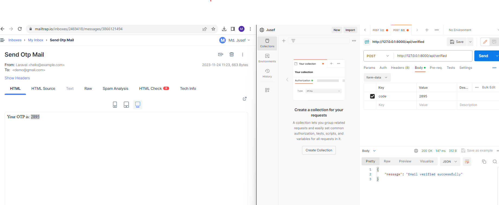

# install laravel:

<pre>composer create-project laravel/laravel authentication</pre>

# jwt authentication:

    <pre>composer require tymon/jwt-auth</pre>
    

<h4>Add the service provider to the providers array in the config/app.php config file as follows: </h4>

<pre>'providers' => [ Tymon\JWTAuth\Providers\LaravelServiceProvider::class, ]</pre>

<h4>Run the following command to publish the package config file:</h4>
 
php artisan vendor:publish --provider="Tymon\JWTAuth\Providers\LaravelServiceProvider"

after running this command config/jwt.php file will be added.

<h4>Generate jwt Secret key using following command:</h4>

php artisan jwt:secret

## Update your User model

Firstly you need to implement the Tymon\JWTAuth\Contracts\JWTSubject contract on your User model, which requires that you implement the 2 methods getJWTIdentifier() and getJWTCustomClaims().

The example below should give you an idea of how this could look. Obviously you should make any changes necessary to suit your own needs.

  namespace App;

use Tymon\JWTAuth\Contracts\JWTSubject;
use Illuminate\Notifications\Notifiable;
use Illuminate\Foundation\Auth\User as Authenticatable;

class User extends Authenticatable implements JWTSubject
{
<?php
    use Notifiable;

    // Rest omitted for brevity

    /**
     * Get the identifier that will be stored in the subject claim of the JWT.
     *
     * @return mixed
     */
    public function getJWTIdentifier()
    {
        return $this->getKey();
    }

    /**
     * Return a key value array, containing any custom claims to be added to the JWT.
     *
     * @return array
     */
    public function getJWTCustomClaims()
    {
        return [];
    }
}
  

## Configure Auth guard

Note: This will only work if you are using Laravel 5.2 and above.

Inside the config/auth.php file you will need to make a few changes to configure Laravel to use the jwt guard to power your application authentication.

Make the following changes to the file:

'defaults' => [
    'guard' => 'api',
    'passwords' => 'users',
],

...

'guards' => [
    'api' => [
        'driver' => 'jwt',
        'provider' => 'users',
    ],
]

## Output Screenshot:
<ul>
  <li><strong>User Register and Send Otp:</strong>
  
  
  </li>
   
  

  <li><strong>User Model Database:</strong>

  
  </li>
     
  

  <li><strong>Email Verification</strong>
  
  </li>
     
  

  <li><strong>After Verified Email</strong>
  
  </li>
     
  

  <li><strong>User Login: </strong>
  
  </li>
     
  

 
 <li><strong>Show Profile: </strong>
  
  </li>
 

  <li><strong>Change User Password: </strong>
  
  </li>
     
  

  <li><strong>Add Product is not accessible for user: </strong>
  
  </li>
     
  

<li><strong>Admin Login </strong>
  
  </li>
     
  

  <li><strong>Add product by admin:  </strong>
  
  </li>
     
  

   <li><strong>Add product by admin:  </strong>
  
  </li>
     
  

  <li><strong>Show Product is not accessible for unregistered user:  </strong>
  
  </li>
     
  

     <li><strong>Show Product:  </strong>
  
  </li>
     
  

 
</ul>
